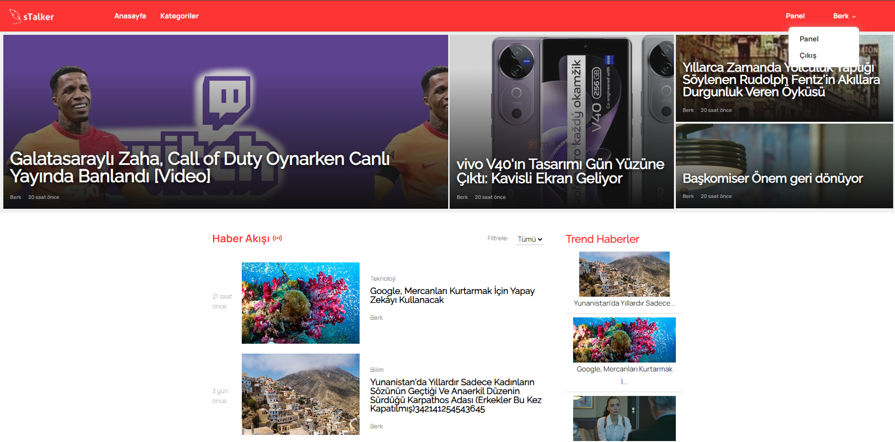
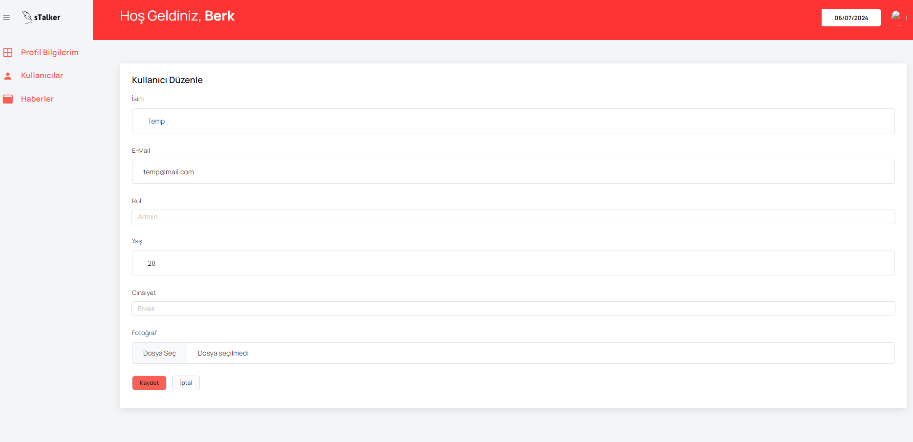
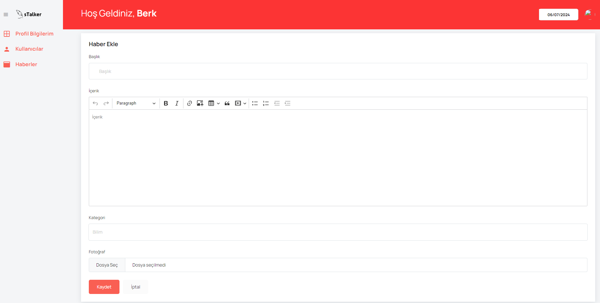

# Laravel 11 Blog Uygulaması

Bu belge, Laravel 11 kullanılarak geliştirilen blog uygulamasının tanımını, özelliklerini ve güvenlik önlemlerini içerir.

## Özellikler

-   **Admin Paneli**: Kullanıcıları ve haberleri yönetmek için bir admin paneli bulunur.
-   **Kullanıcı Yönetimi**: Üç farklı kullanıcı rolü mevcuttur: admin, editör ve standart kullanıcı. Her rol, farklı izinlere sahiptir.
-   **Haber Yönetimi**: Kullanıcılar, haberleri ekleyebilir, düzenleyebilir ve silebilirler. Her haber, başlık, içerik ve görsel gibi temel bilgilerle birlikte gelir.
-   **Yorum Yapma**: Kullanıcılar, gönderilere yorum yapabilirler.
-   **Güvenlik**: Kullanıcı oturumları, yetkilendirme ve güvenlik önlemleri alınmıştır.

## Güvenlik Önlemleri

1. **Kullanıcı Oturumları ve Yetkilendirme**: Laravel'in sağladığı yetkilendirme ve kimlik doğrulama sistemlerini kullanarak, kullanıcı oturumlarını güvenli bir şekilde yönetilmiştir. `Auth` middleware'ini kullanarak erişim kontrolü sağlayın ve sadece yetkilendirilmiş kullanıcıların belirli sayfalara erişimi sağlanır.
2. **Şifreleme**: Hassas veriler (örneğin, kullanıcı parolaları) veritabanında saklanmadan önce, Laravel'in sağladığı bcrypt gibi güçlü şifreleme algoritmalarını kullanarak bu verileri güvenli bir şekilde şifrelenmiştir.
3. **SQL Injection Koruması**: Eloquent ORM veya Query Builder gibi Laravel'in sunduğu veritabanı sorgu yapısını kullanarak, SQL enjeksiyon saldırılarına karşı koruma sağlanmıştır.
4. **XSS (Cross-Site Scripting) Koruması**: Laravel Blade şablon motorunu kullanarak, XSS saldırılarına karşı koruma sağlanmıştır. Kullanıcı tarafından sağlanan verileri güvenli bir şekilde temizleyerek ve ekrana çıktılamadan önce kaçış karakterlerini ekleyerek (örneğin, `{{ $variable }}`), potansiyel XSS saldırılarını engellenmiştir.
5. **CSRF (Cross-Site Request Forgery) Koruması**: Laravel'in CSRF korumasını etkinleştirerek, formların ve AJAX isteklerinin güvenliğini ayarlanmıştır. CSRF token'larını kullanarak, kullanıcının isteğin gerçekten kendisinden geldiği doğrulanmış ve olası saldırılar engellenmiştir.

## Kullanıcı Yetenekleri

-   **Ziyaretçiler**: Üye olmadan blog yazılarını okuyabilir, sayfalar arasında gezinebilir.
-   **Üyeler**: Ziyaretçi yeteneklerine ek olarak, üye olduktan sonra kendi profil bilgilerini güncelleyebilir ve gönderilere yorum yapabilir ve kendi yorumlarını yönetebilir.
-   **Editörler**: Üye yeteneklerine ek olarak, editörler yeni blog gönderileri oluşturabilir, mevcut gönderileri düzenleyebilir ve yayımlanmış gönderilere yorum yapabilir.
-   **Yöneticiler**: Tüm kullanıcıların yeteneklerine sahiptir ve ayrıca tüm blog gönderilerini yönetebilir, kullanıcı hesaplarını yönetebilir ve uygulamanın genel yapılandırmasını değiştirebilir.

## Kullanılan Teknolojiler

-   **PHP 8.2**: Sunucu tarafı iş mantığı için kullanılan programlama dili.
-   **MySQL**: Veritabanı yönetim sistemi olarak kullanılan ilişkisel veritabanı.
-   **Apache**: Web sunucusu olarak kullanılan HTTP sunucusu.
-   **Tailwind CSS ve Bootstrap 5.3**: Kullanıcı arayüzü ve öğeleri için kullanılan CSS çerçeveleri.
-   **CKEditor**: Metin editörü olarak kullanılan WYSIWYG editörü.
-   **jQuery, HTML, CSS, JavaScript**: İstemci tarafı kullanıcı deneyimi için kullanılan web teknolojileri.
-   **Laravel UI ve Composer**: Laravel projesi için kullanılan paket yöneticisi ve kullanıcı arabirimi.

## Kurulum

1. Projeyi GitHub'dan veya bir depodan indirin.
2. Proje dizinine gidin ve `composer install` komutunu çalıştırarak bağımlılıkları yükleyin.
3. `.env.example` dosyasını `.env` olarak kopyalayın ve veritabanı ayarlarınızı yapın.
4. `php artisan key:generate` komutunu çalıştırarak uygulama anahtarını oluşturun.
5. `php artisan migrate` komutunu çalıştırarak veritabanı tablolarını oluşturun.
6. `php artisan serve` komutunu kullanarak yerel sunucuyu başlatın ve projenizi tarayıcınızda görüntüleyin.

## Ekran Görüntüleri

#### Anasayfa

#### Admin Kullanıcı Panel

#### Admin/Editör Haber Panel

## ToDo

-   [ ] Kategori Gösterim Seçenekleri
-   [ ] Kullanıcı Profili
-   [ ] Fotoğraf Bugları
-   [ ] Gönderi Kaynaklar Kısmı
-   [ ] Gönderi Detay Sayfası Düzenlemeleri
-   [ ] Profil Doğrulama
-   [ ] Anasayfa Filtreleme
